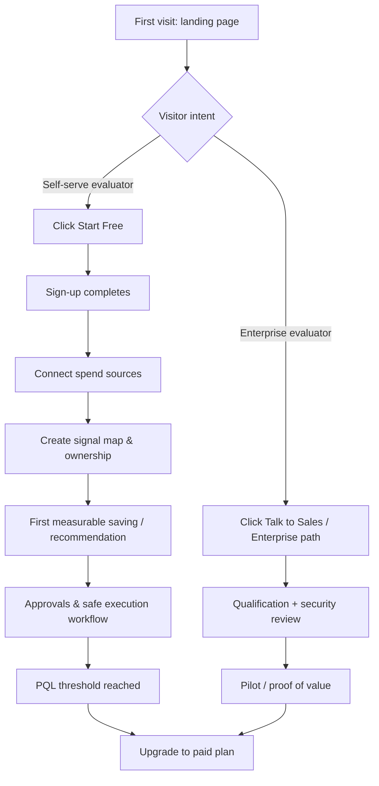

# landing page conversion audit

## Executive summary

The landing page, as shown in the provided screenshot, has **credible foundations for conversion**—clear problem framing (“waste slows roadmap”), **low-friction entry** (“Start free… upgrade only when ready”), an **action-oriented positioning** (visibility → ownership → approvals → safe execution), and **transparent entry pricing** (free tier plus low “from $/mo” tiers). For **self-serve and product-led growth (PLG)** audiences, it can plausibly convert first-time visitors into trials/sign-ups and (with a strong in-product activation experience) into paid plans.

However, whether it converts visitors into **paid customers** at meaningful rates is currently constrained by **trust and proof gaps above the fold** (minimal early social proof, case studies, quantified outcomes with attribution, “why believe this?” evidence) and by a few **decision-friction ambiguities** (what pricing is “based on”, what “capex spend control” operationally means, and what the “first savings workflow” includes/limits). These issues typically depress *paid* conversion even when *sign-up* conversion is good.

Overall conversion prognosis (based on the screenshot alone): **Moderate-to-strong for sign-ups, moderate for paid conversion**, with a straightforward path to improvement via proof, clarity, and activation-focused optimisation.

Assumptions (explicitly unspecified by the screenshot)
- Traffic sources (paid search, organic, outbound, partner, direct) and intent mix are unknown.
- Target ICP likely spans **FinOps / platform engineering / engineering leadership / finance partners**, but segment priorities are not stated.
- Mobile behaviour and performance are unknown (desktop screenshot only).
- In-product onboarding, time-to-value, and upgrade prompts are unknown; these dominate paid conversion for PLG.

## Landing page audit across the requested dimensions

### Headline clarity and value proposition

The headline (“Stop cloud and software waste before it slows your roadmap.”) is **outcome-led** and maps to an executive/engineering concern (shipping speed). It is also broad enough to apply to multiple personas (engineering leadership, FinOps, finance). That breadth helps top-of-funnel acquisition, but it increases the need for **immediate specificity** (what the product actually does differently).

The subhead (paraphrased from the screenshot) introduces the differentiator: a faster path from “spend signal” to “safe execution” with clear ownership, routing overspend to the right owner, and acting safely before waste compounds. This is a strong **positioning wedge** (move from dashboards/alerts to controlled action), and it aligns with how FinOps is practised across iterative phases (Inform → Optimise → Operate). citeturn9search3

Key risk: terms like **“spend signal”** and **“safe execution”** may be clear to FinOps-native teams but can read as jargon for first-time visitors. The page partially mitigates this with the “control loop” framing, but it would benefit from a **one-sentence “what it is”** definition in plain language (“a workflow layer that turns cost findings into owned, approved, safe actions”).

### Visual hierarchy, layout, and scannability

From the screenshot, the layout is generally strong:
- Clear top navigation with pathways for different intents (Product / Live Demo / ROI / Pricing / Enterprise).
- A large hero headline with supporting subhead.
- Boxed callouts that create scan anchors (problem statement, first-quarter potential).
- Repeated card-based structure for features, use-cases, pricing, and “security & readiness”.

Scannability friction:
- Some body text appears **small and low-contrast** on a dark background. That can reduce comprehension and may raise accessibility issues, especially for long sessions or smaller displays. WCAG emphasises sufficient contrast for readability. citeturn9search2turn9search6
- There is a lot of content on a single page (hero → problem model → coverage → action diagram → simulator → pricing → security). This can work when each section pulls the user forward, but it also increases **cognitive load** and the need for intermediate trust markers and repeated “what to do next” cues.

### Hero section effectiveness

**Copy and subhead**
- Strength: the hero correctly identifies a real failure mode: *visibility exists, action doesn’t*. The line “The problem is not visibility… delayed action” is clear and resonates with teams that already have dashboards.
- Risk: the claim “Target 18–30% controllable spend recovery opportunity in the first 90 days” is persuasive but also **credibility-sensitive**. Without an adjacent citation (case study, benchmark, methodology), some prospects will discount it as marketing.

**Primary CTA**
- “Start Free” is a clean primary CTA. The nearby microcopy (“Start free. Upgrade only when ready.”) is excellent risk-reversal for PLG.

**Secondary CTAs**
- “See Enterprise Path” is a strong secondary CTA and helps avoid losing enterprise prospects who need procurement/security review.
- A “live walkthrough”/“signal map” link is useful for evaluators who want understanding before committing.

**Trust signals in hero**
- The hero has limited traditional trust proof (logos, testimonials, press, quantified customer outcomes). This is the single biggest above-the-fold conversion limiter for paid conversion, particularly for finance/security-minded buyers.

### Product explanation and features-to-benefits mapping

The page’s conceptual model is coherent:
- A “control loop” that goes from detection → assignment/approval → safe, measurable reduction (based on the screenshot’s “one control loop” card).
- A “cloud cost trap” section that contrasts “without” vs “with” the product, translating features into consequences (lag, unclear ownership, execution risk).

Strengths
- Benefits are framed as **operational outcomes** (“owner-routed spend control”, “safe execution”, “measurable savings”) rather than generic “visibility”.
- Platform coverage chips shown in the screenshot (AWS/Azure/GCP plus tools like Microsoft 365, Snowflake, Datadog, Kubernetes) communicate breadth quickly—important for reducing “will this work with our stack?” friction.

Gaps
- The page shows a conceptual network diagram (“See it in action”) and an ROI simulator, but it does not visibly show **real product UI screenshots** (tables, workflows, approval screens, audit trails). For a workflow/governance product, UI evidence is a major trust accelerator.
- The “capex” angle is intriguing, but the page needs a clearer mapping of what “capex spend control” means in practical terms (commitments, reserved instances, savings plans, licence commitments, procurement gates, etc.).

### Pricing clarity and friction to purchase

The pricing section is a strong conversion driver because it:
- Offers a **free entry** (“Start Free… Start at $0” in the screenshot).
- Shows three paid tiers with starting monthly prices (“From $49/mo”, “From $149/mo”, “From $299/mo”).
- Connects tiers to use-cases (“focused cloud teams”, “cross-functional shops”, “enterprise teams”).

Main friction points
- It is unclear (from the screenshot) what “from $X/mo” is **priced on**: tracked spend, number of providers, number of workflows, features, or usage volume. Competitors often anchor price to cloud spend tiers (e.g., Vantage explicitly includes a spend amount per plan). citeturn3view0  
  Without an explicit pricing basis, buyers may fear surprise pricing later—even with low starting prices.
- “Free for your first savings workflow” is promising but (as shown) may not list precise limits (e.g., number of signals, providers, data retention, collaboration features). Unclear free-tier limits can increase drop-off during sign-up (people don’t know if it’s “worth wiring in”).

### CTAs across the page

The page uses multiple CTAs:
- Start Free (hero + sticky nav).
- Enterprise path / Talk to Sales.
- Demo/Walkthrough prompts.
- Plan-level “Start with Starter/Growth/Pro”.

This is directionally correct because it supports multiple intents, but it needs careful CTA governance:
- Ensure the **primary CTA remains consistent** (Start Free → sign-up) for PLG paths.
- Ensure enterprise CTAs don’t siphon self-serve users too early (a common anti-pattern is over-promoting “Talk to Sales”).
- Add microcopy where complexity is high (e.g., under Start Free: “No credit card / connect in X minutes / read-only access”, if true).

### Social proof, testimonials, logos, case studies, credibility

From the screenshot, social proof appears limited:
- A single “operator feedback” quote exists lower on the page.
- No prominent hero-area customer logos or quantified case studies are visible.

This is a major gap versus established competitors. For example, Finout’s pricing page includes both **security badges** and a large set of **recognisable customer logos**, which shortens trust-building time for first-time visitors. citeturn3view2

### Trust and security signals

Strengths (from the screenshot)
- A dedicated “Security and Readiness” section.
- “Need formal review?” language and enterprise-oriented calls to action.
- A set of security essentials tags including items like “Single sign-on (SAML)”, “SCIM user provisioning”, “role-based approvals”, “decision history logs”, and “transit encryption” (as shown).

Gaps
- The page appears to say “SOC 2 readiness aligned” rather than “SOC 2 Type II compliant” (based on the screenshot’s phrasing). “Readiness” is weaker than “audited compliance” for enterprise buyers. Competitors like Vantage explicitly state SOC 2 Type II compliance and offer the report on request. citeturn3view1
- A visible link to a **Trust Centre** and a short list of “what data we access + what we never do” would reduce perceived risk for connecting billing data.

### Page performance and technical considerations

From the screenshot alone, actual load speed and responsiveness cannot be measured. Still, the page includes interactive components (scenario simulator sliders) and rich visuals; these often increase JavaScript and render cost.

Recommendations should be anchored to measurable standards:
- Track and optimise **Core Web Vitals** (loading performance, interactivity, visual stability) because they directly reflect real user experience and are recommended by Google for site success. citeturn9search0turn9search4

## User journey, conversion funnel, and friction analysis

### Likely conversion funnel

### Funnel strength: first visit → sign-up

The page is set up well to get the initial click:
- Clear “Start Free” CTA.
- Risk-reversal microcopy (“upgrade only when ready”).
- Visible pricing later for price-sensitive evaluators.

Main friction here is **trust latency**: prospects may click “Start Free” but hesitate when asked to connect billing data if they don’t see strong proof and clear permissions.

### Funnel risk: sign-up → paid conversion

Paid conversion depends on post-sign-up activation. The page hints at activation levers (ownership routing, safe execution, measurable savings), but the biggest determinants are:
- How quickly users can connect sources and see meaningful insight.
- Whether “safe execution” is operationally easier than their current workflow.
- Whether the product produces a “first win” fast (within days, not weeks).

The page’s ROI simulator is a good attempt to make value tangible, but it may also add cognitive load. The simulator should be used as **an activation accelerant** (generate a personalised “expected savings range” and email it) rather than a distraction.

### Primary friction points and cognitive load

Highest-confidence friction points (from screenshot evidence)
- **Credibility gap above the fold**: strong claims, limited proof.
- **Pricing basis ambiguity**: “from $/mo” without an explicit unit.
- **Jargon density**: “spend signal”, “capex spend control”, “control loop” may require translation for some personas.
- **Scroll depth dependence**: the strongest trust signals (security/readiness) are far down the page.

## Organic acquisition, measurement, and tracking recommendations

### SEO and content clarity for organic acquisition

The page is positioned around outcomes (waste, roadmap speed) and FinOps execution, but organic search tends to reward pages that clearly match specific queries with helpful, direct content.

Recommendations grounded in search guidance:
- Build supporting pages that answer specific problems in a people-first way (e.g., “cloud cost approvals workflow”, “FinOps ownership model”, “how to stop cost anomalies safely”), aligning with Google’s guidance on creating helpful, reliable, people-first content. citeturn9search1turn9search9
- Add structured, indexable content that clarifies differentiation (what you do, how, for whom) rather than only conceptual phrasing.

### Analytics and tracking recommendations

A conversion-focused instrumented funnel should capture both marketing and product activation steps.

Suggested implementation pattern
- Use entity["company","Google","technology company"] Analytics 4 recommended/custom events for standardisation and reporting compatibility. citeturn10search0turn10search3
- Implement via Tag Manager for maintainability (especially for marketing ownership). citeturn10search8
- Add product analytics (e.g., autocapture + curated events). PostHog’s autocapture can automatically collect many click/form events, reducing implementation time. citeturn10search1turn10search15
- Define funnels explicitly; funnel analysis is designed to surface drop-off reasons and segment conversion behaviour. citeturn10search2turn10search6

### Six KPIs to track

The KPIs below are measurable, map to the funnel, and support experiment evaluation:

1. **Hero CTA click-through rate (CTR)**: sessions → “Start Free” click.
2. **Sign-up completion rate**: sign-up starts → completed accounts.
3. **Source connection rate**: new accounts → at least one spend source connected within 24–72 hours.
4. **Time to first value (TTFV)**: median time from sign-up to first saved recommendation / first approved action / first measurable savings event (choose one canonical “value moment”).
5. **Product-qualified lead (PQL) rate**: % of new accounts that reach a usage threshold (e.g., ≥1 source + ≥X owners mapped + ≥1 recommendation executed).
6. **Paid conversion rate**: trial/free → paid within 30 days (plus segmentation by persona/company size/spend band).

## Competitive benchmark and prioritised optimisation roadmap

### Competitor comparison table

The table below benchmarks three direct cloud cost optimisation SaaS competitors, using competitor official pages and documentation as primary sources.

| Competitor | Key differentiators (positioning) | Pricing model | Trial options | Trust signals (examples) |
|---|---|---|---|---|
| entity["company","Vantage","cloud cost management vendor"] | Fixed-rate plans tied to tracked spend tiers; includes features like “Autopilot for AWS Savings Plans” in paid tiers. citeturn3view0 | Published tiers: Starter (Free), Pro ($30/mo), Business ($200/mo), Enterprise (Custom). Spend limits and user limits shown per tier. citeturn3view0 | 14-day free trial for Pro/Business; Enterprise “hands on free trial” mentioned. citeturn3view0 | SOC 2 Type II compliant and report available on request; positions security as enterprise-ready. citeturn3view1 |
| entity["company","CloudZero","cloud cost intelligence vendor"] | Cost intelligence with unit cost focus; “code-driven” cost organisation to reduce reliance on perfect tagging; unlimited users included. citeturn3view3 | Tiered, steady pricing described as not varying month-to-month; no monthly overages claimed on the main site (direct purchase). citeturn3view3 | 14-day free trial for qualified accounts. citeturn3view3 | Supports SAML SSO and Just-In-Time provisioning (enterprise IAM expectation). citeturn4view0 |
| entity["company","Finout","finops platform vendor"] | Positions around predictable FinOps cost certainty; emphasises security and recognisable customer set directly on pricing page. citeturn3view2 | “Flat fee pricing” based on tiers of committed/forecasted spend; priced as a yearly fee based on cloud spend; “no surprise overage charges” messaging. citeturn3view2 | Trial model not clearly stated in the visible excerpt of the pricing page (recommend verifying via their sales/demo path). citeturn3view2 | Displays security certifications/badges (ISO 27001, GDPR, SOC) and many customer logos on pricing page. citeturn3view2 |

Implication for Valdics positioning: your screenshot’s “workflow + ownership + approvals + measurable savings” angle is a real differentiator, but competitors often **outperform on proof density** and **pricing-unit clarity** (spend-tier anchoring).

### Suggested hero copy rewrites

Goal: reduce jargon, increase specificity, and strengthen perceived credibility without inflating claims.

**Hero headline (3 variants)**
1. *Turn cloud and SaaS cost signals into owned, approved savings—fast.*
2. *Stop cloud waste with clear ownership and safe, measurable actions.*
3. *From “we saw overspend” to “we fixed it”: cost control that ships.*

**Hero subhead (3 variants)**
1. *Valdics connects spend changes to the right owner, routes approvals, and tracks measurable savings—so teams act before waste compounds.*
2. *Replace dashboards that get ignored with a control loop: detect, assign, approve, execute—across cloud, SaaS, and commitments.*
3. *Built for engineering + finance workflows: clear accountability, fewer fire drills, and a faster path to decisions that stick.*

**Primary CTA copy (3 variants)**
1. *Start free at $0*
2. *Get your first savings workflow*
3. *See your spend control loop*

### Prioritised A/B test and optimisation roadmap

| Priority band | Change / experiment | Hypothesis | Primary metric | Effort | Notes |
|---|---|---|---|---|---|
| Quick win | Add above-the-fold proof strip (customer logos or “trusted by” + 1 quantified case study link) | Credibility increases CTA clicks and reduces hesitation at sign-up | Hero CTA CTR; sign-up completion | Medium | Even 3–6 logos + 1 result metric can materially lift conversion in B2B |
| Quick win | Clarify pricing basis (“priced by tracked spend / workflows / sources”) and free-tier limits | Reduced uncertainty increases plan selection and paid conversion | Pricing CTA CTR; upgrade rate | Low–Medium | Competitors explicitly anchor plans to spend tiers (helps purchases feel predictable). citeturn3view0turn3view2 |
| Quick win | Replace “18–30% in 90 days” with “typical range” + methodology + link to proof | Makes ROI claim believable, improving paid intent | Sign-up completion; Talk to Sales submits | Medium | Keep claim, add “how measured” and sample customer result |
| Quick win | CTA microcopy: “No credit card” / “read-only” / “connect in X minutes” (if true) | Risk-reversal increases sign-ups | Hero CTA CTR; sign-up completion | Low | Especially effective for tools that require billing access |
| Long-term | Add 2–3 short product UI clips (15–30s) showing ownership routing + approvals + audit trail | Concrete evidence improves evaluation and conversion | Trial→paid; sales-qualified leads | High | Workflow products sell faster with UI proof than with conceptual diagrams alone |
| Long-term | Build segment-specific landing variants (FinOps lead vs Eng leader vs Finance) | Message-match increases relevance and conversion | CTA CTR; PQL rate | High | Use URL parameters and paid-search mappings |
| Long-term | Activation-first onboarding: “Connect → map owners → first recommendation” guided checklist | Faster time-to-value increases paid conversion | TTFV; PQL rate; paid conversion | High | This likely matters more than any above-the-fold tweak |

### Experiment designs with sample sizes, metrics, and success criteria

Because real baselines are unspecified, the sample sizes below assume typical B2B SaaS baselines and aim for 80% power at 5% significance (two-sided). Treat them as planning estimates, then re-calc with your actual baselines.

**Experiment A: Hero proof strip vs control**
- Variants: (A) current hero; (B) hero + proof strip (logos + one quantified outcome).
- Primary metric: Hero “Start Free” CTR.
- Assumed baseline and MDE: 5% → 6% (+20% relative).
- Estimated sample size: ~8,100 sessions per variant.
- Success criteria: statistically significant lift in CTR with no degradation in sign-up completion rate (guardrail).

**Experiment B: Pricing basis clarity**
- Variants: (A) current pricing; (B) add explicit pricing unit + free-tier limits + “what triggers upgrade”.
- Primary metric: Pricing section plan-CTA CTR and upgrade intent events.
- Assumed baseline and MDE: 5% → 6.5% (+30% relative) on pricing CTAs.
- Estimated sample size: ~3,800–4,000 sessions per variant (if baseline is closer to 5% and lift is large); re-estimate once measured.
- Success criteria: higher plan-CTA CTR and reduced pricing-page bounce/scroll abandonment.

**Experiment C: CTA copy (“Start Free” vs “Start at $0”)**
- Variants: (A) Start Free; (B) Start at $0; (C) Get your first savings workflow.
- Primary metric: Hero CTA CTR; secondary: sign-up completion.
- Assumed baseline and MDE: 5% CTR with +20% split across multi-variant needs higher traffic; if traffic is low, run A/B first.
- Success criteria: best variant improves CTR without reducing completion quality (PQL rate).

**Experiment D: Activation prompt placement**
- Variants: (A) current; (B) above-the-fold “3-step to first savings” checklist with time estimate.
- Primary metric: Source connection rate within 72 hours, not just clicks (activation is closer to paid conversion).
- Sample size guidance: depends on activation baseline; if activation is 25% and you target 25%→30% (+20% rel), you’ll need several thousand new sign-ups, so run as a longer test or use sequential/Bayesian methods.

Measurement note: Implement standard GA4 events where possible and map SaaS flows to sign_up / generate_lead / purchase-like equivalents. citeturn10search0turn10search3 Use funnel reporting to track drop-offs per segment. citeturn10search2turn10search6

## Verdict: can it convert visitors into paid customers?

Yes—**it can**, especially for **PLG-friendly mid-market teams** that already feel the pain of “visibility without action” and are comfortable trying tools on a self-serve basis. The page’s strongest conversion assets are:
- Clear problem framing and action-oriented differentiation.
- Low-risk entry (start free, upgrade later) and visible pricing tiers.
- Enterprise readiness signals (SAML/SCIM, logs, role-based approvals) that reduce procurement fear later.

But paid conversion will likely underperform potential until the page improves:
- **Proof density** (logos, case studies, quantified outcomes with attribution) near the hero.
- **Pricing unit clarity** and free-tier limits.
- **Concrete product evidence** (UI, workflow examples, “what happens after sign-up” clarity).

Finally, ensure performance and accessibility don’t undermine the experience: measure Core Web Vitals and resolve any issues, since these metrics capture loading, interactivity, and stability in real user sessions. citeturn9search0turn9search4