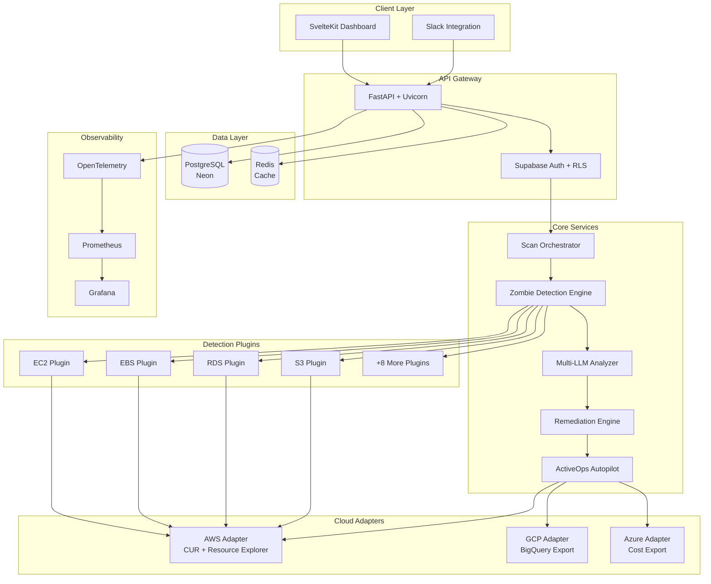
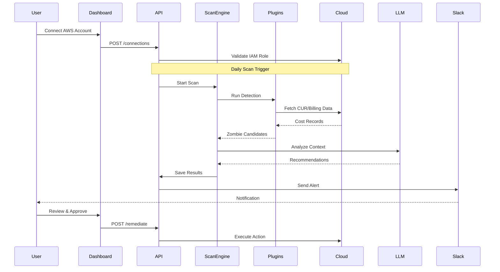
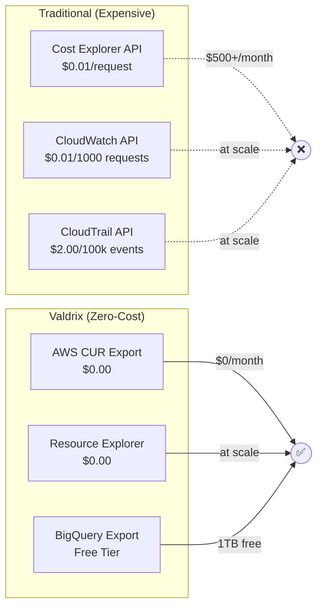
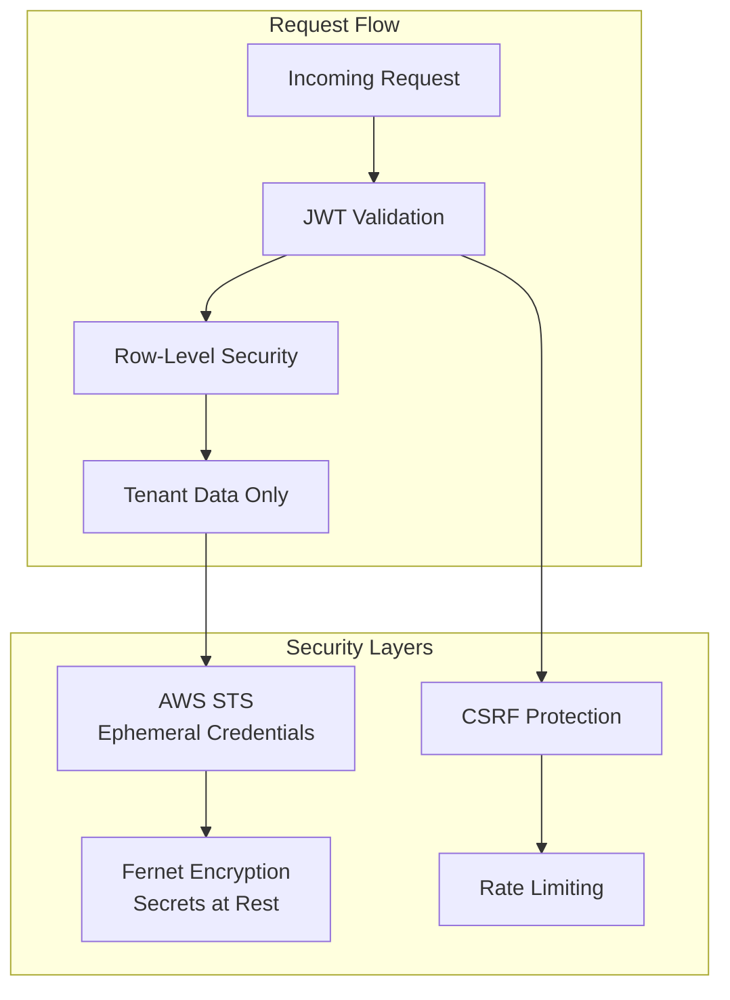
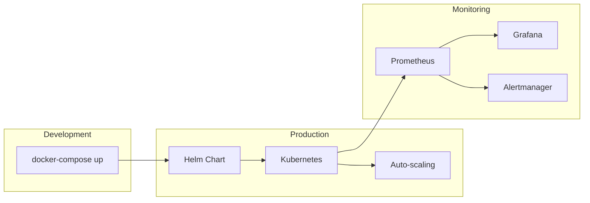

# Valdrix Architecture

This document provides a visual overview of the Valdrix system architecture.

## System Overview

## Data Flow

## Zero-API-Cost Architecture

## Multi-Tenant Security

## Deployment Options

