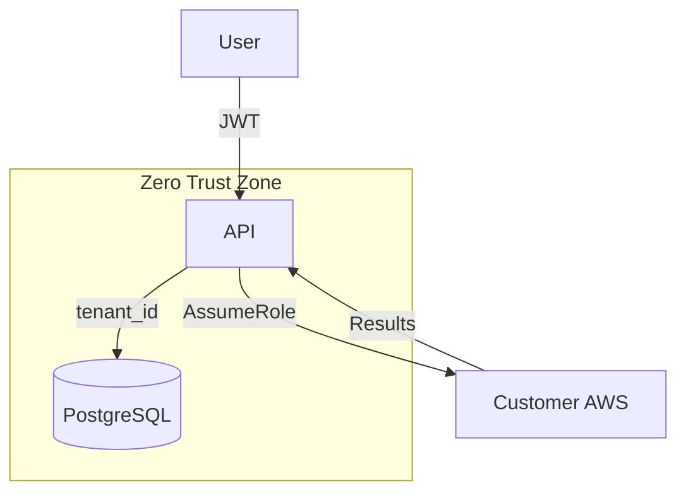

# Zero-Trust Identity Blueprint

## 1. Principles
- **Never Trust, Always Verify**.
- **Least Privilege Access**.
- **Assume Breach**.

## 2. Implementation Layers

### A. Authentication (Identity)
- **Supabase Auth**: Externalized identity provider.
- **MFA Required**: Multi-factor authentication is enforced for all administrative and billing accounts.
- **Short-Lived Sessions**: Tokens expire after 1 hour with secure refresh mechanisms.

### B. Authorization (Access)
- **RBAC (Role-Based Access Control)**: Strictly defined roles (Viewer, Member, Admin).
- **Tenant Isolation**: Every database query includes `tenant_id` filtering (RLS at the DB layer, manual checks in service layer).
- **Service-to-Service**: Use of internal secrets and OIDC for cross-service authentication.

### C. Resource Access
- **STS AssumeRole**: No long-lived cloud credentials.
- **External ID**: Confused deputy protection for AWS connections.
- **JIT (Just-In-Time)**: Credentials are only generated at the time of an operation (scan/remediation).

## 3. Blueprint Diagram

