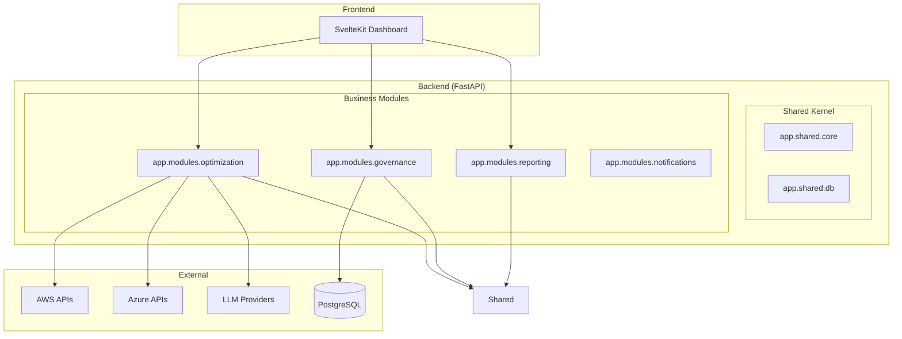
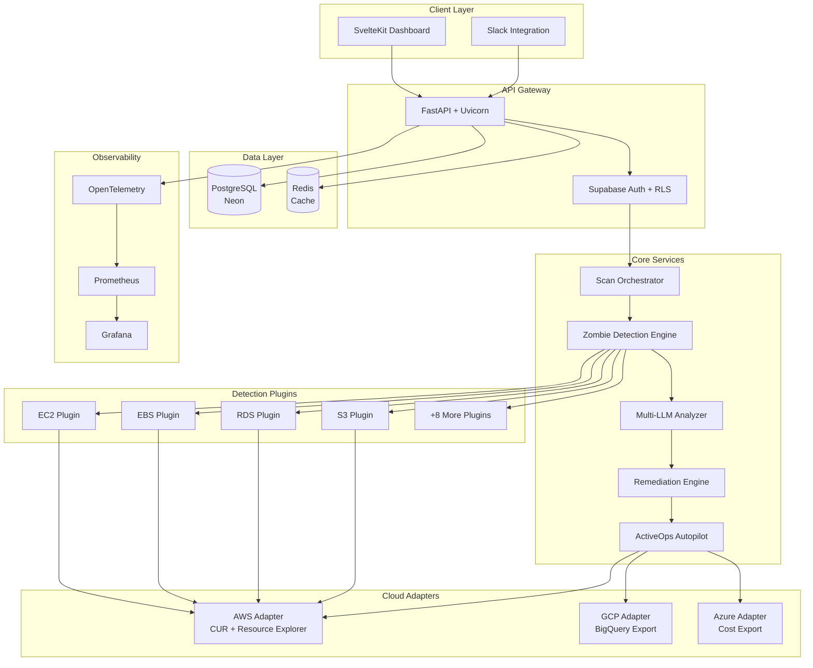
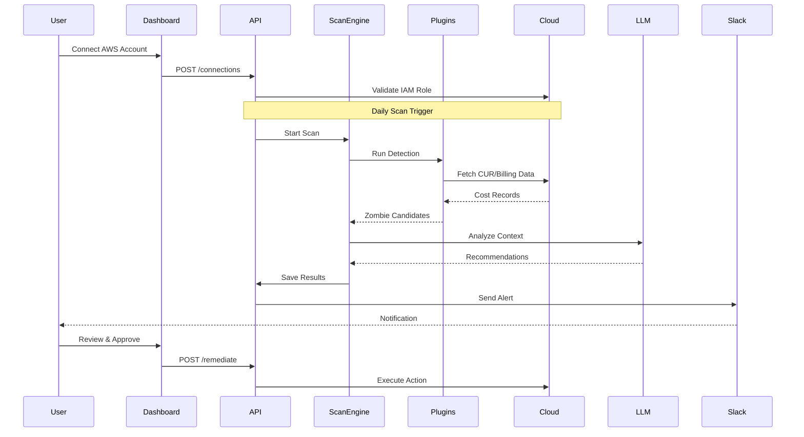
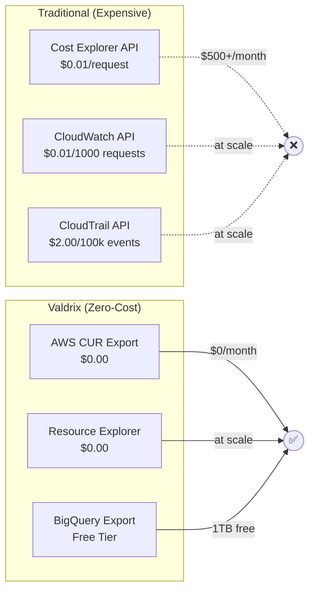
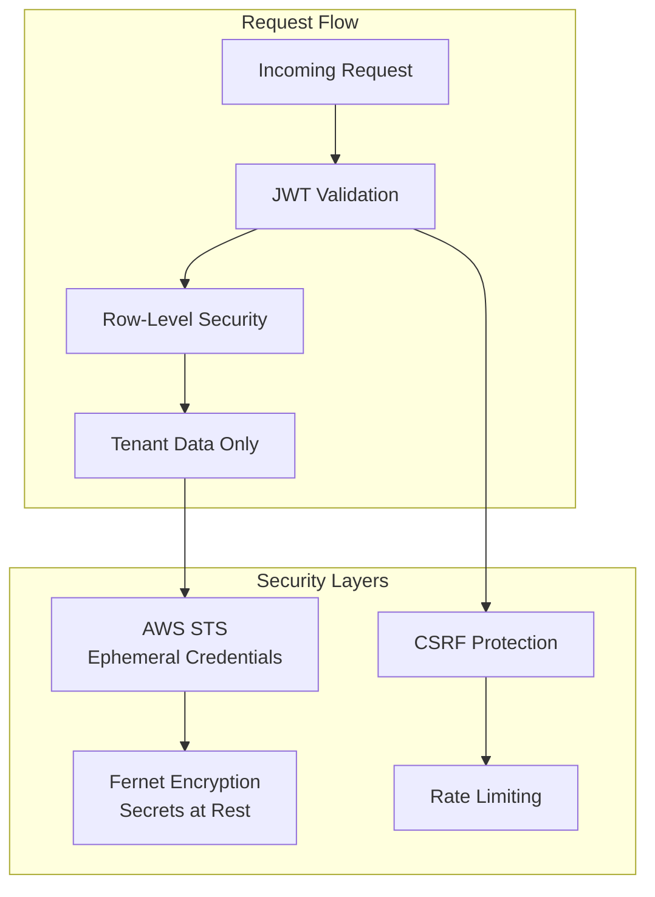
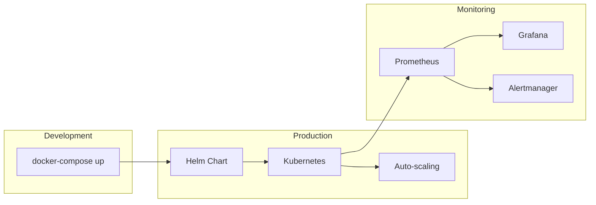

# Valdrix Enterprise Architecture
> **Elite SaaS Standard: Domain-Driven Modular Monolith**

## 🏛️ Architectural Philosophy

Valdrix is engineered as a **Modular Monolith** following **Domain-Driven Design (DDD)** and **Hexagonal (Ports & Adapters)** principles. This ensures the platform remains scalable, testable, and maintainable as it evolves from a single-cloud utility to a multi-cloud enterprise platform.

### Key Pillars
1.  **Modular Isolation**: Every business capability (Governance, Optimization, Reporting) is isolated into its own module.
2.  **Shared Kernel**: Common infrastructure logic is extracted to a centralized `shared` package.
3.  **Clean Boundaries**: Business logic (Domain) is strictly decoupled from infrastructure implementation (Adapters).

---

## 🏗️ System Overview



---

## 📂 Module Structure

Each module in `app/modules/` follows a standardized internal layout to enforce decoupling:

| Component | Responsibility |
| :--- | :--- |
| **`domain/`** | The "Core Brain". Contains pure Python logic, entities, and Port interfaces. **Zero external dependencies (like Boto3).** |
| **`adapters/`** | The "Infrastructure Layer". Implements Port interfaces to interact with AWS, Azure, GCP, or external APIs. |
| **`api/`** | The "Interface Layer". FastAPI routers, response schemas, and DTO mapping. |

---

## 🚀 Key Modules

### 1. Optimization (The Value Engine)
The core intelligence layer that detects zombie resources and calculates potential savings. 
- **Domain:** Rules-engine for identifying "Zombies" across compute, storage, and networking.
- **Adapters:** Cloud-specific scanners for AWS, Azure, and Google Cloud.

### 2. Governance (Operations & IAM)
Manages the "Safety" of the platform.
- **Onboarding:** Automated multi-tenant cloud connection setup.
- **Audit:** SOC2-compliant logging of all system and user actions.
- **Jobs:** Async background task orchestration via Celery/APScheduler.

### 3. Reporting (FinOps & GreenOps)
Aggregates raw statistics into actionable business intelligence.
- **Costs:** Spend attribution and ROI tracking.
- **Carbon:** GreenOps calculator using region-specific carbon intensity markers.

---

## 🔐 Security & Multi-Tenancy

- **Identity Isolation**: Valdrix utilizes **Supabase Auth** with strict **Row Level Security (RLS)** in the database.
- **Cloud Security**: No persistent AWS keys stored. Valdrix uses **AWS STS (AssumeRole)** to generate ephemeral, single-use credentials for every scan operation.
- **Data Protection**: Sensitive cloud configuration data is encrypted at rest using **AES-256**.

---

## 💰 Zero-API-Cost Architecture

Valdrix is designed to minimize or eliminate AWS API costs billed to the customer's account.

### Data Sources (Customer Cost: ~$0.00)

| Data Type | Source | Customer Cost |
|---|---|---|
| **Cost Data** | AWS CUR 2.0 (S3 Parquet) | ~$0.02/month (S3) |
| **Resource Discovery** | AWS Resource Explorer 2 | Free |
| **Idle Detection** | CUR Usage Analysis | Free |

### Key Design Principles

1.  **CUR-First**: Cost data is ingested from Cost & Usage Reports (S3), not the Cost Explorer API ($0.01/request).
2.  **Search, Don't Scan**: Resource discovery uses the global Resource Explorer 2 index instead of per-region API calls.
3.  **Infer, Don't Query**: Idle instances are identified from CUR usage patterns, eliminating CloudWatch API calls.

### CloudFormation Templates

*   [valdrix-role.yaml](../cloudformation/valdrix-role.yaml) - IAM role for read-only access (NO Cost Explorer permissions).
*   [valdrix-cur-setup.yaml](../cloudformation/valdrix-cur-setup.yaml) - Automated S3 bucket and CUR report creation.

---

## ☸️ Kubernetes Deployment

Valdrix is production-ready with Kubernetes manifests in `k8s/`:

| Manifest | Purpose |
|---|---|
| `deployment.yaml` | API + Worker deployments with security hardening |
| `service.yaml` | ClusterIP and headless services |
| `configmap.yaml` | Application configuration |
| `hpa.yaml` | Horizontal Pod Autoscaler (3→20 replicas) |
| `ingress.yaml` | TLS, rate limiting, security headers |

### Security Features
- **Non-root containers** with read-only filesystem
- **Resource limits** preventing noisy neighbor issues
- **Pod anti-affinity** for high availability
- **Topology spread** across availability zones

### Quick Deploy
```bash
kubectl apply -f k8s/
```

---

## 🧪 Load Testing

Valdrix includes comprehensive load testing tools in `loadtest/`:

| Tool | File | Use Case |
|---|---|---|
| **k6** | `k6-test.js` | CI/CD automated performance testing |
| **Locust** | `locustfile.py` | Exploratory testing with Web UI |

### Performance Targets

| Metric | Target | Critical |
|---|---|---|
| p95 Latency | < 500ms | < 1500ms |
| Error Rate | < 1% | < 5% |
| Throughput | > 100 RPS | > 50 RPS |

### Run Tests
```bash
# k6 (recommended for CI)
k6 run loadtest/k6-test.js

# Locust (Web UI at localhost:8089)
locust -f loadtest/locustfile.py --host=http://localhost:8000
```

---

## 📋 Compliance & SBOM

Valdrix generates Software Bill of Materials (SBOM) for supply chain security.

### Automated Generation
- **GitHub Action**: `.github/workflows/sbom.yml`
- **Format**: CycloneDX JSON
- **Tools**: Syft (container), CycloneDX (Python)
- **Vulnerability Scanning**: Grype with high severity blocking

### SBOM Output
Generated SBOMs are stored in `sbom/` and include:
- Python dependency inventory
- Container image components
- License compliance report

### Compliance Standards
- SOC 2 Type II audit logging
- GDPR-ready data isolation (RLS)
- Executive Order 14028 SBOM requirements
# Valdrix Architecture

This document provides a visual overview of the Valdrix system architecture.

## System Overview



## Data Flow



## Zero-API-Cost Architecture



## Multi-Tenant Security



## Deployment Options


