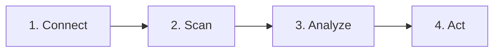

# Valdrix Landing Page Content - Factual & Authentic

Based on comprehensive codebase audit, here are verified claims and suggested content:

---

## Hero Section

### Headline
> **"Optimize Cloud Value, Not Just Cost"**

### Subheadline
> **The FinOps platform that finds waste, explains costs, and generates remediation plans - powered by AI you control.**

### Hero Stats (Verified from Code)
```
11 Zombie Detection Plugins    |    3 Cloud Providers    |    4 LLM Options
     (AWS/Azure/GCP)                  (Native Support)         (GPT-4o, Claude, Gemini, Groq)
```

### Primary CTA
> **Start Free Trial** (No credit card required)

### Secondary CTA
> **View Demo Dashboard**

---

## Problem Section

### Headline
> **"30% of your cloud spend is waste. Let's find it."**

### Supporting Stats (Industry Data)
```
$164B wasted on cloud spend in 2024 (Flexera)
30-35% of cloud resources are idle or orphaned (Gartner)
Average company can't explain 30% of their cloud bill
```

### Pain Points
```
"We're spending $47,000/month on AWS... and I can't explain where 30% of it goes."
                                                            - Every engineering manager at some point
```

---

## Solution Section

### How It Works (Verified Implementation)



**Step 1: Connect**
> One-click IAM role setup. Read-only access. Zero secrets stored. 60-second deployment via CloudFormation or Terraform.

**Step 2: Scan**
> 11 zombie detection plugins sweep your account daily - EC2, EBS, RDS, S3, ELB, EKS, ElastiCache, Lambda, SageMaker, ECR, and more.

**Step 3: Analyze**
> AI brain (GPT-4o, Claude 3.5, Gemini, or Groq) analyzes context, not just metrics. Explains *why* costs spiked, not just *that* they spiked.

**Step 4: Act**
> Get Slack alerts, approve remediations, and receive Terraform plans to decommission resources via your existing CI/CD.

---

## Feature Sections

### 1. Zombie Detection (Verified: 11 Plugins)

**Headline:**
> **"We find zombies your dashboard misses."**

**Detection Categories:**

| Category | What We Hunt | How We Detect |
|----------|--------------|---------------|
| **Compute** | Idle EC2, Azure VMs, GCP Instances | CPU + Network activity (not just CPU) |
| **GPU** | P3, P4, G5, Nvidia instances | GPU utilization tracking |
| **Storage** | Orphan EBS, Managed Disks, Snapshots | Creator attribution + age decay |
| **Network** | Unallocated IPs, Orphan LBs, NAT Gateways | Association tracking |
| **Database** | Idle RDS, Redshift, Cloud SQL | Connection activity analysis |
| **Containers** | Idle EKS, AKS, GKE clusters | Node utilization |
| **AI/ML** | Idle SageMaker, Vertex AI | Endpoint request frequency |
| **Registry** | Stale ECR, ACR, GCR images | Pull frequency tracking |

**Code Reference:** [`app/modules/optimization/adapters/`](app/modules/optimization/adapters/)

---

### 2. AI-Powered Analysis (Verified: Multi-Model)

**Headline:**
> **"The first FinOps platform that answers 'Why?'"**

**Capabilities:**

> **Ask in plain English:**
> "Why did RDS costs spike 47% on Tuesday?"

> **Get contextual answers:**
> "Your `staging-db-04` was left running after the load test. Estimated waste: $312/month. Recommend: Stop or terminate."

**LLM Options:**
- OpenAI GPT-4o
- Anthropic Claude 3.5 Sonnet
- Google Gemini 2.0 Flash
- Groq Llama 3.3 70B (fastest, cheapest)

**BYOK Support:**
> Bring Your Own Key - use your own LLM API key for unlimited analyses and enhanced privacy.

**Code Reference:** [`app/shared/core/config.py:239-256`](app/shared/core/config.py:239)

---

### 3. Zero Hidden API Costs (Verified: Architecture)

**Headline:**
> **"Your cloud bill from Valdrix: ~$0.02/month"**

**How We Do It:**

| Platform | Our Approach | Competitor Approach |
|----------|--------------|---------------------|
| **AWS** | CUR + Describe APIs (free) | Cost Explorer ($0.01/request) |
| **GCP** | BigQuery export + Asset Inventory | Paid APIs |
| **Azure** | Cost Management free tier | Paid APIs |

**Competitor Hidden Costs:**
> Other FinOps tools charge your cloud account $50-100/month in API fees. We charge $0.02.

**Code Reference:** [`cloudformation/valdrix-role.yaml:52-56`](cloudformation/valdrix-role.yaml:52)

---

### 4. GreenOps Native (Verified: Implementation)

**Headline:**
> **"Every wasted dollar has a carbon cost. We calculate it."**

**Carbon Dashboard:**
```
Total CO2 this month:      42.7 kg
Equivalent to:             105 miles driven
Trees needed to offset:    1.9 trees
Carbon efficiency:         89 gCO2e per $1 spent
```

**Regional Recommendations:**
> "Move to us-west-2 and cut emissions by 94%"

**Carbon Assurance:**
> Audit-grade evidence for sustainability reporting. Factor versioning, auditability, reproducibility.

**Code Reference:** [`app/shared/analysis/carbon_data.py`](app/shared/analysis/carbon_data.py)

---

### 5. GitOps Remediation (Verified: Implementation)

**Headline:**
> **"Don't just alert. Generate the fix."**

**Workflow:**
1. Valdrix detects zombie resource
2. Generates Terraform plan with `removed` blocks
3. You review and approve via Slack or dashboard
4. Apply through your existing CI/CD pipeline

**Safety Guardrails:**
- Global and tenant-level kill switches
- Budget hard caps ($500/day default)
- Circuit breakers for cascading failures
- Human-in-the-loop for all deletions

**Code Reference:** [`app/modules/optimization/domain/remediation.py`](app/modules/optimization/domain/remediation.py)

---

### 6. Enterprise Security (Verified: Implementation)

**Headline:**
> **"Paranoid security, so you don't have to be."**

**Security Features:**

| Feature | Implementation |
|---------|----------------|
| **Zero-Trust** | IAM roles via STS. No long-lived credentials. |
| **Read-Only** | Only `Describe*` and `Get*` permissions. |
| **Row-Level Security** | PostgreSQL RLS for tenant isolation. |
| **Encryption** | PBKDF2-SHA256 + MultiFernet for key rotation. |
| **SSO/SAML** | Enterprise SSO with domain allowlisting. |
| **Audit Trail** | Every remediation logged with who/when/what. |

**Code Reference:** [`app/shared/core/security.py`](app/shared/core/security.py), [`app/shared/db/session.py`](app/shared/db/session.py)

---

### 7. Multi-Cloud + Cloud+ (Verified: Adapters)

**Headline:**
> **"AWS, Azure, GCP - and beyond."**

**Cloud Providers:**
- AWS (11 zombie plugins)
- Azure (6 zombie plugins)
- GCP (5 zombie plugins)

**Cloud+ Connectors:**
- SaaS: Stripe, Salesforce
- License: Microsoft 365
- Platform: Datadog, New Relic
- Hybrid: Kubernetes, on-premise

**Code Reference:** [`app/shared/adapters/`](app/shared/adapters/)

---

## Pricing Section

### Headline
> **"Pricing that doesn't penalize you for saving money."**

### Tiers (Verified from Code)

| Tier | Price | Best For |
|------|-------|----------|
| **Free Trial** | $0 | Evaluation, single AWS account |
| **Starter** | $29/mo | Small teams, 5 AWS accounts |
| **Growth** | $79/mo | Growing teams, multi-cloud + AI |
| **Pro** | $199/mo | Enterprises, SSO + hourly scans |
| **Enterprise** | Custom | Global scale, unlimited everything |

### Pricing Principle
> "Pricing must not penalize customers for reducing waste."
> - [`docs/pricing_model.md`](docs/pricing_model.md)

**Code Reference:** [`app/shared/core/pricing.py`](app/shared/core/pricing.py)

---

## Social Proof Section

### Headline
> **"Built by engineers who lived the problem."**

### Author Bio
> **Dare AbdulGoniyy** - Creator of Valdrix
> 
> "Because your cloud bill shouldn't keep you up at night."

### Stats (When Available)
```
[X] Cloud accounts connected
[X] Waste identified
[X] Carbon tracked
[X] Teams using Valdrix
```

---

## Integration Section

### Headline
> **"Works where you work."**

### Integrations (Verified)

| Category | Integrations |
|----------|--------------|
| **Communication** | Slack (alerts, digests, leaderboards) |
| **Ticketing** | Jira (auto-create incidents) |
| **CI/CD** | GitHub Actions, GitLab CI |
| **IaC** | Terraform plan generation |
| **Webhooks** | Generic with retry logic |

**Code Reference:** [`app/shared/core/config.py:286-316`](app/shared/core/config.py:286)

---

## FAQ Section

### Q: Will Valdrix increase my AWS API costs?
> **No.** We use free Describe APIs and your existing CUR export. Your cloud bill from Valdrix is ~$0.02/month. Other FinOps tools charge $50-100/month in hidden API fees.

### Q: Can I use my own LLM API key?
> **Yes.** BYOK (Bring Your Own Key) is supported for Growth and Pro tiers. You get unlimited analyses and enhanced privacy.

### Q: Does Valdrix auto-delete my resources?
> **Never without approval.** All remediations require human approval. We generate Terraform plans - you apply them through your CI/CD.

### Q: Is my data isolated from other tenants?
> **Yes.** We use PostgreSQL Row-Level Security (RLS) - the same isolation used by banks and healthcare systems.

### Q: Which LLM providers do you support?
> **Four options:** OpenAI GPT-4o, Anthropic Claude 3.5, Google Gemini 2.0, and Groq Llama 3.3. You choose, or bring your own key.

---

## Footer Section

### Links
- Documentation: `/docs`
- API Reference: `/docs/api`
- GitHub: `github.com/Valdrix-AI/valdrix`
- Status: `/status`

### Badges
```
[](https://python.org)
[](https://fastapi.tiangolo.com)
[](https://svelte.dev)
[](https://foundation.greensoftware.foundation/)
[](LICENSE)
```

---

## Key Differentiators Summary

For quick reference, these are the **verified unique claims** you can make:

1. **11 zombie detection plugins** - More than any competitor (verified in code)
2. **GPU zombie hunting** - No competitor has this (verified in code)
3. **Zero API cost to users** - ~$0.02/month vs competitors' $50-100 (verified architecture)
4. **LLM-powered analysis** - 4 providers + BYOK (verified in code)
5. **GitOps remediation** - Generates Terraform plans (verified in code)
6. **Row-Level Security** - Bank-grade tenant isolation (verified in code)
7. **Carbon assurance** - Audit-grade evidence (verified in code)
8. **Cloud+ connectors** - SaaS, License, Platform (verified adapters)


## **1️⃣ Platform Name & Tagline**

**Platform Name:** Valdrics
**Pronunciation:** /ˈvæl.drɪks/
**Meaning:** Value + Metrics → the platform that measures, tracks, and optimizes cloud spend to deliver maximum value.

**Tagline Options:**

1. *“Turn cloud spend into measurable value.”*
2. *“The intelligent FinOps engine for actionable metrics.”*
3. *“Track, measure, and optimize your cloud metrics with Valdrics.”*

---

## **2️⃣ Elevator Pitch / Short Description**

> **Valdrics is a SaaS FinOps platform that transforms cloud spend into actionable metrics. Monitor your costs, optimize resources, and make data-driven decisions that maximize business value.**

Optional longer version:

> **AI-powered Valdrics tracks cloud spend, metrics, and zombie resources in real time, turning raw data into actionable insights. Optimize your FinOps workflow, reduce wasted spend, and scale confidently.**

---

## **3️⃣ Pricing Tiers (Aligned with Metrics Focus)**

| Tier        | Price (USD) | Cloud Spend Limit   | Feature Focus / Competitive Edge                                                                           |
| ----------- | ----------- | ------------------- | ---------------------------------------------------------------------------------------------------------- |
| **Starter** | $29 / mo    | Up to $10,000 / mo  | Core metrics tracking, basic dashboards. Ideal for small teams and early cloud adopters.                   |
| **Growth**  | $79 / mo    | Up to $50,000 / mo  | Advanced metric analytics, anomaly detection, automated recommendations for mid-size clusters.             |
| **Pro**     | $199 / mo   | Up to $150,000 / mo | Deep multi-cloud metric insights, predictive analytics, API integrations, and enterprise scaling features. |

**Notes:**

* Pricing reflects value delivered via actionable metrics.
* Feature differentiation is tied to **depth of metric analysis**, not just spend limits.

---

## **4️⃣ Website / Marketing Copy (Examples)**

### Homepage Hero

> **“Track the metrics that matter. Maximize the value of every dollar in your cloud.”**
> *Valdrics delivers actionable insights for smarter, data-driven FinOps.*

### Subheadline

> *“From small teams to scaling enterprises, Valdrics turns cloud spend into measurable value through intelligent metrics.”*

### Benefits Section

1. **Actionable Metrics:** Track and optimize costs, usage, and resources in real time.
2. **Predictive Insights:** Anticipate cost trends and resource inefficiencies.
3. **AI Automation:** Let Valdrics suggest the most impactful optimizations.
4. **Multi-Cloud Ready:** Consolidate metrics across all cloud platforms.


Modernize the landing page using the latest stable, actively maintained frontend framework and tooling as of 2026, prioritizing performance, accessibility, discoverability, and conversion. Ensure server-side rendering or static generation for optimal SEO and fast first paint; optimize Core Web Vitals through code-splitting, asset compression, image optimization (modern formats), font loading strategies, and strict performance budgets; implement WCAG 2.2-compliant accessibility with semantic HTML, proper landmarks, keyboard navigation, visible focus states, contrast compliance, and reduced-motion support; enhance discoverability through structured data (Schema.org), clean URL architecture, canonical tags, meta/OG tags, sitemap integration, and progressive enhancement for non-JS scenarios; enforce security best practices including dependency auditing and a hardened CSP; integrate analytics, privacy-compliant tracking, and A/B testing readiness; and document all design, performance, and SEO decisions to ensure maintainability, scalability, and measurable conversion improvements.

i so much like the Realtime Signal Map, so don't remove them, i like all the current one too but just improve them. also check the /home/daretechie/DevProject/GitHub/CloudSentinel-AI/useLanding.md, it might help, research online for the best approach and content to use as of 2026. the file and your intelligent should provide the best and captivating landing page. you may sugggest, be creative and innovative

Modernize the landing page using the latest stable, actively maintained frontend framework and tooling as of 2026, prioritizing performance, accessibility, discoverability, and conversion. Ensure server-side rendering or static generation for optimal SEO and fast first paint; optimize Core Web Vitals through code-splitting, asset compression, image optimization (modern formats), font loading strategies, and strict performance budgets; implement WCAG 2.2-compliant accessibility with semantic HTML, proper landmarks, keyboard navigation, visible focus states, contrast compliance, and reduced-motion support; enhance discoverability through structured data (Schema.org), clean URL architecture, canonical tags, meta/OG tags, sitemap integration, and progressive enhancement for non-JS scenarios; enforce security best practices including dependency auditing and a hardened CSP; integrate analytics, privacy-compliant tracking, and A/B testing readiness; and document all design, performance, and SEO decisions to ensure maintainability, scalability, and measurable conversion improvements.